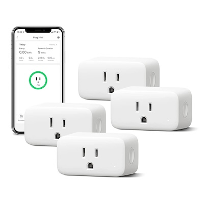
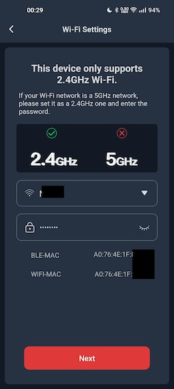
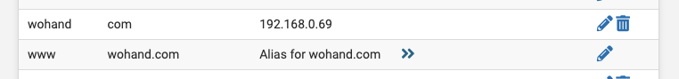
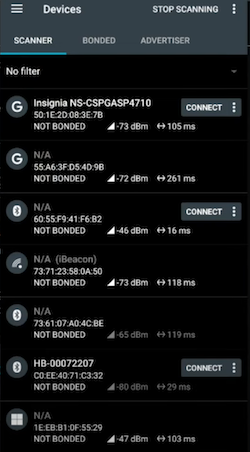
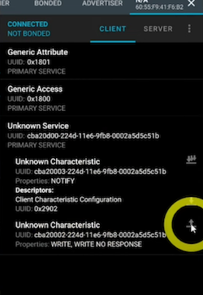
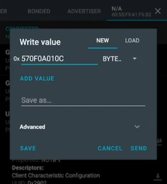
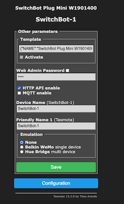
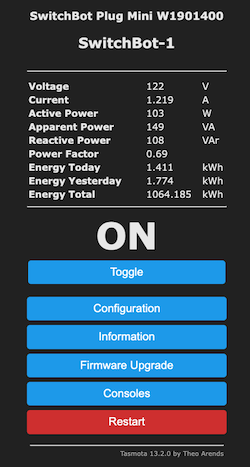

# SwitchbOTA

This project helps to replace the default firmware on the SwitchBot Smart Plug Mini via an OTA update, enabling the use of Tasmota open-source firmware without disassembling the device.

## SwitchBot Hardware Details

There are two SKUs of the SwitchBot Smart Plug Mini released in the US: 

- The original "Smart Plug Mini" with model number W1901400, released in early 2022. As of 2023-12, Amazon sells these in [four-packs](https://www.amazon.com/dp/B09YV2L3MN) for about $30, [two-packs](https://www.amazon.com/dp/B09YV3LH8Y) for $19, or [one-packs](https://www.amazon.com/dp/B09QFLJH8T) for $12
- The updated "HomeKit Smart Plug Mini" with model number W1901401, released later in 2022. As of 2023-12, Amazon sells these in [four-packs](https://www.amazon.com/dp/B0B9RHTM6Y) for about $38 or [one-packs](https://www.amazon.com/dp/B0B39DJFR8) for $15

Some details about the devices are as follows:

- Both devices use identical circuitry. The only difference is the firmware used. More detail can be found in https://github.com/kendallgoto/switchbota/issues/19
- They use Type B NEMA 5-15 plugs and sockets
- They are ultrasonically welded shut, requiring destruction of the plastic housing to access the circuits within. There are no screws to allow access to the internals, the way there is with the Sonoff S31
- They use the Shanghai Belling BL0937 energy measurement IC to track power usage
- They use the Espressif ESP32-C3 chip for WiFi, Bluetooth Low Energy (BLE), and circuit control. See [here](https://tasmota.github.io/docs/ESP32/#esp32-differences) to learn about the different types of ESP32. The MAC addresses for WiFi and BLE follow the [ESP32 standard](https://docs.espressif.com/projects/esp-idf/en/latest/esp32c3/api-reference/system/misc_system_api.html#mac-address) of having an offset of two. If the WIFI-MAC is `34:85:18:0F:CC:DC`, then the BLE-MAC is `34:85:18:0F:CC:DE` (DC in hex is 220, DE is 222)
- The SwitchbOTA flashing process is confirmed to work on both device models using firmware v1.4 or older (v1.3, v1.2)

## Disclaimer
Writing to the bootloader over OTA is dangerous and not normally done for good reason. If your device loses power or somehow flashes corrupted data, the device will be bricked and require disassembly to reprogram the device. Only perform this process if you are comfortable disassembling your plug to fix it if it breaks! Of course, do not unplug or otherwise disturb the plug while it is performing the OTA.

**This is a proof of concept and provided with no warranty.**

## Part 1: Plug Setup

- **TL;DR: Connect the plug to your WiFi network**
- Install the SwitchBot app on your phone https://play.google.com/store/apps/details?id=com.theswitchbot.switchbot
- Sign in or create an account (necessary to allow devices to be added/configured)
- Plug the plug into a wall outlet
- In-app, add a device. It's safe to connect it to your WiFi network. 
  - Note down the BLE-MAC during this process, as it will be referenced later
  - This step uses Bluetooth Low Energy (BLE) to scan for devices and send the WiFi network information

- In-app, check the device firmware by going to its settings. As of 2023-12, there was no firmware update button, and the firmware version was v1.4. If you do see the upgrade button, do not press it and wait for a later part
- DONE! The plug is now ready for the firmware flashing process

## Part 2: Network and Server Setup 

- **TL;DR: Configure your router & DNS to redirect calls to a local IP. Run a local NodeJS server at that IP**
- Note down the LAN/local IP address where the NodeJS server will be run. For this example, it will be `192.168.0.69`
- Configure your router and/or DNS to redirect calls to SwitchBot servers to instead hit your NodeJS server
  - This means that a DNS override or custom DNS record should be added, redirecting both `www.wohand.com` and `wohand.com` to the IP where the NodeJS server will be run. More detail can be found at https://github.com/kendallgoto/switchbota/issues/3#issuecomment-1121828064
  - In pfSense, this can be done in the Services->DNS Resolver or Forwarder by adding a Host Override with Host `www` and Domain `wohand.com` and a second override with Host `wohand` and Domain `com`, both having an IP of 192.168.0.69. Save the override and Apply the settings

   - In PiHole, this can be done in the Local DNS->DNS Records by setting the Domain to `www.wohand.com` and `wohand.com` and the IP to 192.168.0.69
  - If your router does not support custom DNS entries, it will almost certainly support setting a custom DNS server. This may be found in the DHCP settings or the System settings. Set the custom DNS server to 192.168.0.69
- Run a local NodeJS server to act in place of the real firmware update server and instead deliver modified firmware files: firstly the OTA file, and then the Tasmota firmware file
  - Install NodeJS on your computer https://nodejs.org/en/learn/getting-started/how-to-install-nodejs
  - Using a CLI or Terminal, `cd` into the `server/` directory and run `npm i` (short for `npm install`) to install the dependencies required for this project
  - Once the previous command completes, run `node index.js` to run the server. 
    - OR, if you could not set up a DNS record in the previous step, run `node index.js 192.168.0.69` . This will start the server, in addition to a Man-in-the-middle DNS server that redirects `*wohand.com` calls to the IP of the NodeJS server, rather than the public IP of `*wohand.com`. All other DNS lookups will be unaffected
  - The CLI or Terminal should show `Server listening on port 80`. Keep this window open for the duration of the flashing process
- Test the DNS functionality by opening a new CLI or Terminal and running `ping wohand.com` and `ping www.wohand.com` to confirm that the local IP shows up. In this example, look for 192.168.0.69
- Test the Node server functionality by opening the SwitchBot app and then looking at the terminal where Node is running. A new line should have shown up similar to `::ffff:192.168.0.101 - /version/wocaotech/release.json`. This indicates the server was accessed instead of the real `wohand.com` and that it successfully served a JSON file to the app. The IP 192.168.0.101 is the IP of the phone running the app. 
- DONE! The network is now configured and the server should now be ready to serve firmware files to the plug

## Part 3: Firmware Flashing

- **TL;DR: Send BLE commands to the SwitchBot plug to trigger the firmware upgrade process**
- If you saw an upgrade button in the SwitchBot app, it is now safe to hit that button. No additional actions should be needed, and the firmware replacement process should complete. If no button is present in the SwitchBot app, proceed
- Install an app such as [nRF Connect for Mobile](https://play.google.com/store/apps/details?id=no.nordicsemi.android.mcp). This will be used to connect to the Bluetooth Low Energy (BLE) radio of the plug to trigger the firmware update process. [Bluetility for Mac](https://github.com/jnross/Bluetility) is also reported to work
- Follow the instructions below, or watch [the video](https://youtu.be/iTexFQ0Th0I?si=zB-leDeiz82yL9Cy&t=635), or read the GitHub issues outlining the process https://github.com/kendallgoto/switchbota/issues/43  https://github.com/kendallgoto/switchbota/issues/3#issuecomment-1121864522
- Using the BLE app of choice, scan for devices and Connect to the device matching the BLE-MAC noted from the SwitchBot app

- Make sure the app is on the Client tab, then expand "Unknown Service" and look at the options within. The last option, "Unknown Characteristic" should have Properties such as "WRITE" and an upload button on the right side. Hit the Upload button on the right side to bring up the Write screen.

- Select the BYTE_ARRAY type from the dropdown and enter in the hex code `57 0F 0A 01 0C` (without spaces). Then it Send to transmit the command to the plug
  - The last two characters represent the firmware version to be flashed, and must be different from the current firmware version. `0C` (as shown above) represents v1.2, `0D` represents v1.3, `0E` represents v1.4. `0C` should be safe to use by default. More detail can be found [here](https://github.com/kendallgoto/switchbota/issues/3#issuecomment-1491004013) 

- Wait a few seconds and look at the NodeJS log to verify the command worked as it should. You should see something such as `::ffff:192.168.0.131 - /version/wocaotech/firmware/WoPlugUS/WoPlugUS_V12.bin` which indicates the NodeJS server was able to send the first `.bin` file to the plug
- Wait about a minute after seeing the NodeJS server log to give the plug time to get ready for the next step.
- Now send a new BYTE_ARRAY command in the BLE app (nRF Connect) with hex `57 0F 0B`. Hit Send to trigger the second and final firmware flash step
- Wait a few seconds again and then look at the NodeJS log to verify the command worked as it should. You should see something such as `::ffff:192.168.0.131 - /payload.bin` which indicates the NodeJS server was able to send the Tasmota `.bin` file to the plug
- DONE! The firmware flashing should be complete

## Part 4: Tasmota Setup

- **TL;DR: Connect to the Tasmota WiFI. Configure the actual WiFi. Update the firmware. Apply the SwitchBot Tasmota Template. Configure the device**
- NOTE: The NodeJS server is configured to flash Tasmota `tasmota32c3.factory.bin` which is described to be a "Factory binary to be used for initial flashing using esptool." The distinguishing factor is that a factory binary includes an entire partition table, bootloader, etc. rather than just application partition that is later sent for OTA binaries in the future.
- NOTE: The flashed Tasmota version is `v11.1.0 Ostara` and not a later version. This is because `v12.0.0 Paul` changed the partition layout, making the ESPHome firmware harder to flash onto the plug. This change is described in more detail at https://tasmota.github.io/docs/Safeboot/
- Connect to the Tasmota WiFi. It should be an unsecured WiFi network with SSID `tasmota-0c3d4f-1234` showing a portion of the WiFi MAC address and a random number. Once connected, configure it to connect to the real WiFi network. It will likely reuse the IP address it had earlier during the flashing process, which in this example was 192.168.0.131. 
- Reconnect your phone to the real WiFi network and navigate to the Tasmota webpage, in this case http://192.168.0.131. Click "Firmware Upgrade," confirm the OTA URL is http://ota.tasmota.com/tasmota32/release/tasmota32c3.bin or something similar, and click "Start Upgrade." Wait a few minutes as the plug updates its firmware and reconnects to WiFi
- Once the Tasmota page is accessible again, go to "Configuration" and then "Configure Other." In the Template section, paste the following value and check the "Activate" button. Also feel free to change the Device Name, which shows up on the Tasmota home page. Finally, click "Save" and wait for the Tasmota to restart
  - `{"NAME":"SwitchBot Smart Plug Mini W1901400","GPIO":[0,0,32,0,0,0,224,320,321,0,0,0,0,0,0,0,0,0,2720,2656,2624,0],"FLAG":0,"BASE":1}`
  - The template can also be found on the Tasmota device repository https://templates.blakadder.com/switchbot_plugmini_W1901400.html
  - The `GPIO` numbers refer to the different GPIO device IDs, found at https://tasmota.github.io/docs/Components/.  The `BASE` refers to a base template, which in this case is 1 or `ESP32C3`

- Perform the Power Calibration following the instructions in https://tasmota.github.io/docs/Power-Monitoring-Calibration/
  - NOTE: Power Calibration is technically optional but not doing it can cause the power readings to be off by an order of magnitude. It is highly recommended to perform Power Calibration
  - I used a Kill-a-watt and a portable space heater or hair dryer after confirming it was in a mode that had a Power Factor of 0.99 or 1.0. 
  - I then used the Kill-a-watt to note the voltage, wattage, and amperage (in my case, 122.3V, 778W, 6.36A)
  - I then used the [Backlog](https://tasmota.github.io/docs/Commands/#the-power-of-backlog) command in the Tasmota Console to write all three values at once: `Backlog0 VoltageSet 122.3; PowerSet 778; CurrentSet 6360` 
  
- A helpful pointer is to configure the time zone, and set up Daylight Savings https://tasmota.github.io/docs/Timezone-Table/
- DONE! The SwitchBot Smart Plug Mini is now fully configured and ready to enter service

____

## Firmware Update Sequence Detail
The included ESP-IDF code is a lightweight OTA client that directly writes to the embedded flash chip, enabling the install of non-app level code, including modfiying the bootloader and partiton table.

1. The update is triggered by the app with a BLE message, such as `57 0F 0A 01 0C`
2. The device fetches `http://www.wohand.com/version/wocaotech/firmware/WoPlugUS/WoPlugUS_VXX.bin` for the firmware
3. The request is intercepted and served by the NodeJS web server, which downloads the Espressif binary
4. The factory firmware installs the binary to ota_0 or ota_1, depending on past usage
5. The binary runs from its OTA partition. If it's on ota_1, it skips to step 6. Otherwise, it performs another OTA, downloading itself into ota_1 and rebooting.
6. Once on OTA_1, the device fetches `http://www.wohand.com/payload.bin` for OTA
7. The request is intercepted and served by the NodeJS web server, delivering our desired payload (Tasmota firmware)
8. The Espressif binary wipes the internal flash and flashes the payload. It performs two checksums, one of the downloaded binary and another of the flashed binary. It will continue to retry without restarting until the checksums are valid

## Troubleshooting
The WiFi configuration is read from the device's NVS memory by the Espressif binary. This should be configured in the SwitchBot app prior to the process. If for whatever reason it is lost, the binary will make a fallback connection to SSID `switchbota`, password `switchbota`. You may need to create this SSID to recover the device.

## Donations
To support my work, consider making a purchase from SwitchBot using my [affiliate link](https://us.switch-bot.com/?sca_ref=2185819.iOqi8Gnz5f). Alternatively, please see my sponsor page [here](https://github.com/sponsors/kendallgoto).

## Links and Resources

- The digiblurDIY Youtube channel has a video guide for this process, and the website has additional details, including detail on the alternate firmware ESPHome
  - Video: https://www.youtube.com/watch?v=iTexFQ0Th0I
  - Website: https://digiblur.com/wiki/devices/plugs/switchbot_15_amp_w1901400/
- This project is similar to https://github.com/khcnz/Espressif2Arduino
- GitHub Issues/Discussions
  - Discussion on OTA and BLE procedure https://github.com/kendallgoto/switchbota/issues/3
  - Discussion on Tasmota version and incompatibility with ESPHome https://github.com/kendallgoto/switchbota/issues/31
  - Recent write-up on the flashing process https://github.com/kendallgoto/switchbota/issues/43
- Tasmota
  - Documentation https://tasmota.github.io/docs/
  - GitHub https://github.com/arendst/Tasmota
  - Firmware (ESP32-specific) https://ota.tasmota.com/tasmota32/release/
  - Template for SwitchBot https://templates.blakadder.com/switchbot_plugmini_W1901400.html
- SwitchBot App
  - Google Play Store https://play.google.com/store/apps/details?id=com.theswitchbot.switchbot
  - iOS https://apps.apple.com/us/app/switchbot/id1087374760
- nRF Connect App
  - Google Play Store https://play.google.com/store/apps/details?id=no.nordicsemi.android.mcp
  - iOS https://apps.apple.com/us/app/nrf-connect-for-mobile/id1054362403
